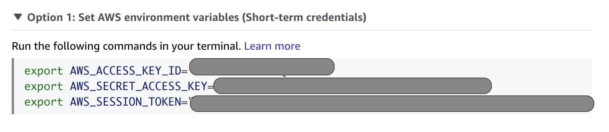

# Vcluster pitch
***
Short Description about the project.


## Bereitstellung der AWS Cloud Komponenten
(Bevor man mit diesen Teil anfängt, muss man Terraform-cli, aws-cli, vcluster und kubectl installieren)
1. an den ordner infrastructur-aws/eks-cluster-v 
```
cd infrastructur-aws/eks-cluster-v/
```
2. Folgende Befehle ausführen, um die gesamte infrastruktur zu bauen

```
terraform init
```
```
terraform plan
```
```
terraform apply
```
 3. Abrufen der Zugangsdaten für AWS Administratoren.

4. Konfigurieren Sie AWS-Umgebungsvariablen (Kurzzeit-Anmeldeinformationen)
Geben Sie in Ihrem Terminal die folgenden Befehle aus.

```
aws eks --region eu-central-1 update-kubeconfig --name main-eks-vcluster
```
5. Alle vcluster auflisten
```
vcluster list
```


6. Verbindung mit vCluster herstellen und nutzen (vcluster connect [vcluster-name])
```
vcluster connect admin-vcluster
```
danach

7. Den Terminal nicht schließen und einen neuen Terminal aufmachen
```
kubectl get namespaces
```
8. An den Ordner TESTS navigieren, um den nginx und seinen service und ingress zu Deployen
```
kubectl create -f testing-v-admin-isolation.yaml
```
9. SERVICE-IP erhalten/kopieren port ist 8080

```
kubectl get services -o wide
```

10. Die Verbindung mit vcluster trennen und zu den Host Cluster zu wechseln

```
vcluster disconnect
```
Zu den ersten Terminal gehen und ***CTRL+C*** benutzen

11. Die Verbindung mit dem dev-vcluster herzustellen

```
vcluster connect dev-vcluster
```
12. Tests durchführen 

```
kubectl run tmp-pod --image=busybox -it --rm --restart=Never -- wget -O- [SERVICE-IP]:8080
```
Vergiss nicht, wenn alle Tests durchgeführt ist die Verbindung von vcluser zu trennen [vcluster disconnect]


### Prometheus & Grafana
um den Cluster zu monitoren steht prometheus und Grafana zur Verfügung. Führe folgende Schritte aus:
1. Ersten die Verbindung mit Prometheus herstellen
```
kubectl port-forward -n prometheus prometheus-prometheus-kube-prometheus-prometheus-0 9090 --address=0.0.0.0
```
2. Einen anderen Terminal aufmachen dann mit Grafana verbinden. ersetze [*] mit dem Rest der grafana pod name
```
kubectl get pod -n prometheus
```
```
kubectl port-forward -n prometheus prometheus-grafana-[*] 3000 --address=0.0.0.0
```


[//]: # ()
[//]: # (Test Scenario)

[//]: # (#TODO Nginx mit ingress auf v-admin von v-dev auf v-admin zugreifen)

[//]: # (vcluster connect v-admin --namespace administration)

[//]: # (kubectl apply -f testing-v-admin-isolation.yaml)

[//]: # (kubectl get svc)

[//]: # (NAMESPACE       NAME                       TYPE           CLUSTER-IP      EXTERNAL-IP   PORT&#40;S&#41;                      AGE    SELECTOR)

[//]: # (kube-system     kube-dns                   ClusterIP      10.43.107.200   <none>        53/UDP,53/TCP,9153/TCP       22h    k8s-app=kube-dns)

[//]: # (default         kubernetes                 ClusterIP      10.43.245.97    <none>        443/TCP                      22h    <none>)

[//]: # (default         isolation-test-svc         ClusterIP      10.43.224.183   <none>        80/TCP                       108m   app=iso-test)

[//]: # (nginx-ingress   nginx-ingress-controller   LoadBalancer   10.43.1.128     <pending>     80:32163/TCP,443:32373/TCP   101m   app.kubernetes.io/instance=nginx-ingress,app.kubernetes.io/name=nginx-ingress)

[//]: # ()
[//]: # (kubectl run tmp-pod --image=busybox -it --rm --restart=Never -- wget -O- 10.43.224.183)

[//]: # (# kubectl patch svc nginx-ingress-controller -n nginx-ingress -p '{"spec": {"type": "LoadBalancer", "externalIPs":["192.168.99.100"]}}')

[//]: # (```)

[//]: # (vcluster create v-admin -n administration --create-namespace=true --connect=false --isolate=true -f admin-values.yaml)

[//]: # (vcluster create v-admin -n administration --create-namespace=true --connect=false --isolate=true)

[//]: # (```)

[//]: # (vcluster connect v-admin --namespace administration)

[//]: # (kubectl patch svc isolation-test-svc -p '{"spec": {"type": "LoadBalancer", "externalIPs":["192.168.99.100"]}}')

[//]: # (```)

[//]: # (vcluster connect v-admin --namespace administration)

[//]: # (```)

[//]: # ()
[//]: # (#TODO Kosten vergleich zwischen vcluster und cluster basiertend multi-tenancy)

[//]: # (#TODO mit netzwerk alle pods ip testen entweder mit netstat oder mit wireshark)

[//]: # (#TODO CHECK: Service sind nicht zugreifbar außerhalb vcluser)

[//]: # (aws eks --region eu-central-1 update-kubeconfig --name main-eks-vcluster)

[//]: # ()
[//]: # (#TODO Vollständige isollierung mit networkpolicy)

[//]: # (#TODO Für networkpolicy für Terraform)

[//]: # (#Dokumentation)

[//]: # (#Readme)


