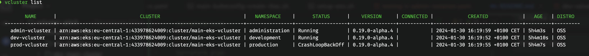
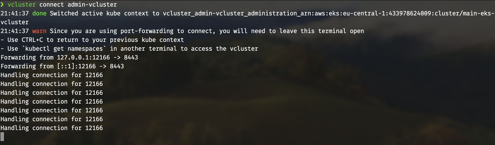
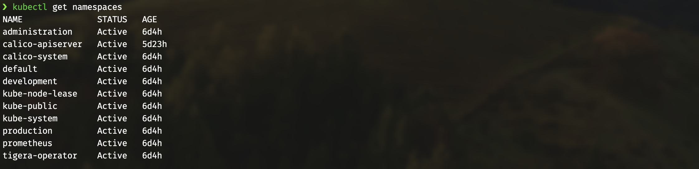
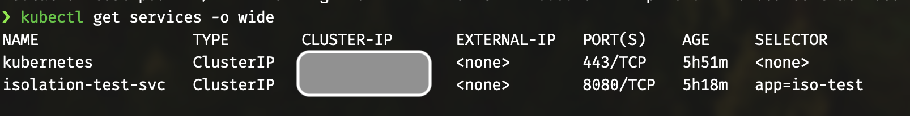
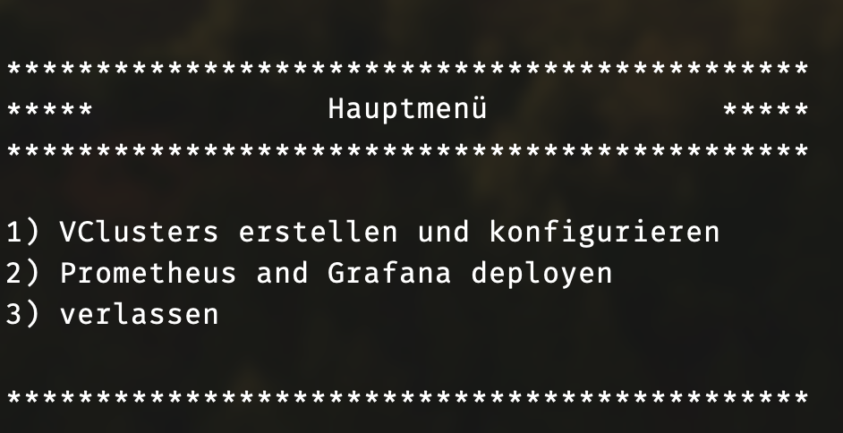
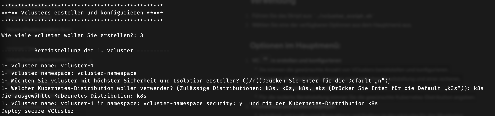
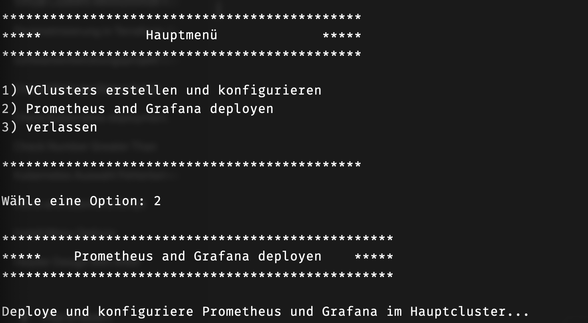

# Vcluster pitch 
***
# Vcluster Projektübersicht

## Kurzbeschreibung
Vcluster ist eine innovative Technologie im Bereich der Kubernetes-Cluster. 
Es handelt sich um voll funktionsfähige Kubernetes-Cluster, die auf anderen Kubernetes-Clustern laufen. 
Im Vergleich zu eigenständigen "echten" Clustern nutzen vcluster die Worker Nodes und das Netzwerk des Host-Clusters, 
während sie ihre eigene Kontrollebene haben und alle Workloads in einem einzigen Namespace des Host-Clusters planen.

##### Warum Vcluster nützlich ist:
* ***Effiziente Ressourcennutzung***: Vcluster ermöglicht es, mehrere virtuelle Cluster innerhalb eines physischen Kubernetes-Clusters zu erstellen. 
Das bedeutet, dass Teams oder Projekte ihre eigenen isolierten Clusterumgebungen haben können, ohne separate physische Clusterressourcen zu benötigen. 
Dies verbessert die Ressourcennutzung und reduziert die Kosten.

* ***Isolation und Sicherheit***: Jeder virtuelle Cluster ist isoliert, was bedeutet, 
dass Anwendungen und Ressourcen in einem virtuellen Cluster nicht mit denen in einem anderen sich gegenseitig zu beeinflussen. 
Dies erhöht die Sicherheit und verringert das Risiko von Konflikten zwischen Teams oder Projekten.

* ***Flexibilität***: Vcluster bietet Flexibilität in der Cluster-Verwaltung. 
Es ist einfacher, virtuelle Cluster nach Bedarf zu erstellen oder zu löschen, was eine schnellere Anpassung an sich ändernde Anforderungen ermöglicht.

* ***Einfachere Verwaltung***: Die Verwaltung vieler physischer Kubernetes-Cluster kann kompliziert sein. 
Vcluster vereinfacht diesen Prozess, da alle virtuellen Cluster unter einem einzigen physischen Cluster verwaltet werden können.

#### Hauptfeatures von Vcluster:
* ***Multi-Tenancy***: Ermöglicht die Erstellung mehrerer virtueller Cluster für verschiedene Teams oder Projekte innerhalb eines einzigen Kubernetes-Clusters.

* ***Kompatibilität***: Vcluster ist weitgehend kompatibel mit Standard-Kubernetes-APIs und -Tools, was bedeutet, dass bestehende Tools und Prozesse weiterhin verwendet werden können.

* ***Isolierte Netzwerke***: Jeder virtuelle Cluster kann sein eigenes isoliertes Netzwerk haben, was die Sicherheit und Unabhängigkeit zwischen den Clustern erhöht.

* ***Anpassbare Ressourcenzuweisung***: Ressourcen wie CPU, Speicher und Speicherplatz können für jeden virtuellen Cluster individuell zugewiesen und angepasst werden.

* ***Einfache Integration***: Vcluster lässt sich leicht in bestehende CI/CD-Pipelines und DevOps-Prozesse integrieren.

* ***Cluster-übergreifende Kommunikation***: Ermöglicht die Kommunikation zwischen verschiedenen virtuellen Clustern, wenn dies erforderlich ist.

Insgesamt bietet Vcluster eine flexible, effiziente und sichere Lösung für die Verwaltung von Kubernetes-Clustern, 
insbesondere in Umgebungen mit hohen Anforderungen an Multi-Tenancy und Ressourcenoptimierung.

+ Quellen:
  - [What are Virtual Kubernetes Clusters?](https://www.vcluster.com/docs/what-are-virtual-clusters)
  - [Intro to vcluster](https://loft.sh/blog/intro-to-vcluster-tutorial/)

## Bereitstellung der Lokalen Komponenten
***

### Voraussetzungen
* Betriebssystem: ***Linux***, ***macOS***
* ***brew*** für macOS-Nutzer, für die Installation von Minikube.
* Installiertes ***curl*** Kommandozeilen-Tool
* Installiertes ***kubectl*** sollte noch nicht installiert sein, da das Skript überprüft, ob es bereits vorhanden ist.
* Installiertes ***helm*** für die Installation von Prometheus und Grafana
* ***jq*** für JSON-Verarbeitungen im Skript.

### Installation und Bereitstellung der lokalen Umgebung mittels des Skripts `local-environment/setup-env.sh.
1. #### Minikube Installation:
Das Skript erkennt automatisch das Betriebssystem und installiert Minikube entsprechend. 
Für Linux wird Minikube direkt von Google Storage heruntergeladen und installiert, während für macOS Minikube über Homebrew installiert wird.

2. #### kubectl Installation:
 Wenn ***kubectl*** nicht gefunden wird, wird es heruntergeladen und installiert.

3. #### vcluster CLI-Tool Installation:
Ebenso wird das vcluster CLI-Tool installiert, wenn es nicht bereits installiert ist.

### Nutzung
1. #### Starten von Minikube:
Das Skript startet Minikube mit Calico als Netzwerk-Plugin.

2. #### Erstellung von vClustern:
Es werden virtuelle Cluster (vCluster) in den Namensräumen 'administration', 'development' und 'production' erstellt.

3. #### Konfiguration von Network Policies:
Für jeden vCluster werden spezifische Netzwerkrichtlinien erstellt. Sowohl für den admin-vCluster als auch für den prod-vCluster wird der Zugang (Ingress) sowie der Abgang (Egress) verweigert (siehe `local-environment/config/role-rbac-tmp/`), 
d.h., jeglicher Ein- und Austritt wird blockiert. Für den dev-vCluster sind zu Testzwecken der Austritt (Egress) erlaubt, jedoch der Zugang (Ingress) nicht.

4. #### Einrichtung von RBAC:
Für jeden vCluster werden RBAC-Rollen und Service Accounts erstellt. Das Skript kubeconfig-create-rbac.sh wird für die Generierung der notwendigen RBAC-Konfigurationen verwendet.

5. #### Monitoring Setup:
Ein Monitoring vCluster wird erstellt und verbunden. Danach wird der Metrics Server installiert und konfiguriert, gefolgt von der Installation und Konfiguration von Prometheus und Grafana im Haupt-Cluster.

6. #### Erstellen von Service Accounts:
Das Skript wird verwendet, um Service Accounts mit spezifischen RBAC-Rollen zu erstellen.
Service Accounts sind speziell für die Authentifizierung und Autorisierung von Prozessen innerhalb eines Kubernetes-Clusters konzipiert, die in Pods laufen. 
Jeder Namespace hat eigene Service Accounts haben, die spezifische Zugriffsrechte und Rollen innerhalb dieses Namespace besitzen. 
Kurz gesagt, dienen Service Accounts zwei Hauptzwecken:
* ***Authentifizierung***: Sie identifizieren die Anwendung oder den Prozess, der innerhalb eines Pods läuft, gegenüber dem Kubernetes-System. 
Dies ist wichtig, um zu bestimmen, ob der Prozess die Erlaubnis hat, bestimmte Aktionen auszuführen.
* ***Autorisierung:***: Nachdem der Prozess authentifiziert wurde, bestimmt der Service Account, welche Berechtigungen dieser Prozess hat. Dies wird üblicherweise durch Rollen und Rollenbindungen verwaltet, die definieren, was ein Service Account innerhalb eines bestimmten Namespace tun darf.
### Ausführung

* Öffnen Sie ein Terminal und navigieren Sie zum Verzeichnis des Skripts.
```
cd **YOUR-PATH**/local-environment/
```
* Machen Sie das Skript ausführbar mit dem Befehl.
```
chmod +x setup-env.sh
```
* Führen Sie das Skript aus mit:
```
./setup-env.sh
```
* Befolgen Sie Anweisungen auf dem Bildschirm, um die Einrichtung abzuschließen.


🚨 ***Wichtige Hinweise*** 🚨<br />
* Stellen Sie sicher, dass Sie über Administratorrechte verfügen, da das Skript bestimmte Befehle mit `sudo` ausführt.
* Überprüfen Sie nach der Ausführung des Skripts die Installation durch Ausführen von minikube start und sicherstellen, dass keine Fehler auftreten.
* Für die Installation und Konfiguration von Prometheus und Grafana wird `helm` benötigt. Stellen Sie sicher, dass `helm` korrekt konfiguriert ist, bevor Sie diesen Teil des Skripts ausführen.
* Stellen Sie sicher, dass Sie über die notwendigen Berechtigungen verfügen, um die Skripte auf Ihrem System auszuführen.
Einige Skripte erfordern spezifische Argumente (z.B. Service Account Name, Namespace). Achten Sie darauf, diese korrekt anzugeben.
Die Installation und Konfiguration von Kubernetes-Tools kann je nach Ihrer Systemkonfiguration variieren.

### Architektur
Die Architektur, die durch das Bash-Script aufgebaut wird, schafft eine strukturierte Umgebung, 
in der die Entwicklungs-, Produktions- und Administrationsprozesse in isolierten und kontrollierten vClustern ablaufen. 
Dies ermöglicht eine effiziente Verwaltung der Ressourcen und eine klare Trennung der Zuständigkeiten. 
Das Monitoring stellt sicher, dass die Leistung der einzelnen Komponenten überwacht wird und Probleme schnell erkannt und behoben werden können.

[//]: # ()

***
## Bereitstellung der AWS Cloud Komponenten
***
### Archittektur


## Voraussetzungen
Bevor Sie beginnen, stellen Sie sicher, dass folgende Tools auf Ihrem System installiert sind:
- [Terraform-cli](https://developer.hashicorp.com/terraform/tutorials/aws-get-started/install-cli)
- [AWS-cli](https://docs.aws.amazon.com/cli/latest/userguide/getting-started-install.html)
- [vcluster-cli](https://www.vcluster.com/docs/getting-started/setup)
- [kubectl](https://kubernetes.io/docs/tasks/tools/)

Zusätzlich benötigen Sie ein AWS-Konto und entsprechende Berechtigungen, 
um Ressourcen zu erstellen und zu verwalten.
## Bereitstellung der AWS Cloud Komponenten

### Schritt 1: Vorbereitung
Wechseln Sie in das Verzeichnis `infrastructur-aws/eks-cluster-v`:
```bash
cd infrastructur-aws/eks-cluster-v/
```

### Schritt 2: Infrastruktur aufbauen
Führen Sie die folgenden Befehle aus, um die Infrastruktur mit Terraform zu initialisieren und zu erstellen:

```bash
terraform init
terraform plan
terraform apply
```
### Schritt 3: AWS Zugangsdaten abrufen
Abrufen der Zugangsdaten für AWS Administratoren. Dies ermöglicht die Verwaltung der erstellten Ressourcen.
* [AWS IAM Identity Center credentials](https://docs.aws.amazon.com/cli/latest/userguide/sso-configure-profile-token.html#sso-configure-profile-token-auto-sso)
* [Option 1: Set AWS environment variables](https://docs.aws.amazon.com/console/singlesignon/user-portal/aws-accounts/command-line/get-credentials/option1)
* [Option 2: Manually add a profile to your AWS credentials file](https://docs.aws.amazon.com/console/singlesignon/user-portal/aws-accounts/command-line/get-credentials/option2)
* [Option 3: Use individual values in your AWS service client](https://docs.aws.amazon.com/console/singlesignon/user-portal/aws-accounts/command-line/get-credentials/option3)
### Schritt 4: AWS-Umgebungsvariablen konfigurieren
Konfigurieren Sie Kurzzeit-Anmeldeinformationen in Ihrem Terminal:

```
aws eks --region eu-central-1 update-kubeconfig --name main-eks-vcluster
```
### Schritt 5: vcluster auflisten und verbinden
Liste alle verfügbaren vcluster auf und stelle eine Verbindung her:

```
vcluster list
vcluster connect admin-vcluster
```


### Schritt 6: Verbindung mit vCluster
Stellen Sie eine Verbindung zum vCluster her und nutzen Sie diesen (vcluster connect [vcluster-name]):
```
vcluster connect admin-vcluster
```

### Schritt 7: Neue Terminal-Session
Lassen Sie den Terminal offen und öffnen Sie einen neuen Terminal. Führen Sie dort aus:
```
kubectl get namespaces
```




### Schritt 8: Deployment von Testanwendungen
Navigieren Sie zum Ordner TESTS, um den nginx, seinen Service und Ingress zu deployen:
```
kubectl create -f testing-v-admin-isolation.yaml
```
### Schritt 9: SERVICE-IP abrufen
Abrufen und Kopieren der SERVICE-IP (Port 8080):
```
kubectl get services -o wide
```


### Schritt 10: Wechsel zum Host Cluster
Trennen Sie die Verbindung zum vcluster und wechseln Sie zum Host Cluster:

```
vcluster disconnect
```
Kehren Sie zum ersten Terminal zurück und verwenden Sie ***CTRL+C***.

### Schritt 11: Verbindung mit dem dev-vcluster
Stellen Sie die Verbindung mit dem dev-vcluster her:

```
vcluster connect dev-vcluster
```
### Schritt 12: Tests durchführen, um die Isolation der vCluster von anderen Host-Workloads zu überprüfen
In diesem Schritt führen Sie einen Test durch, um sicherzustellen, dass der admin-vCluster) 
richtig isoliert ist und dass Services innerhalb des admin-vCluster von anderen virtuellen Clustern, 
wie dem dev-vCluster, wie erwartet nicht erreicht werden können.

Hier ist, was Sie tun:

Sie verwenden einen temporären Pod im `dev-vcluster`, ausgestattet mit BusyBox, um den Service zu erreichen. 
Mit wget im Pod versuchen Sie, den Service über dessen IP-Adresse und Port (z.B. 8080) zu erreichen, 
um die Verfügbarkeit zu prüfen.
Führen Sie den folgenden Befehl aus, um den Test zu starten:
```
kubectl run tmp-pod --image=busybox -it --rm --restart=Never -- wget -O- [SERVICE-IP]:8080
```
Trennen Sie nach Abschluss aller Tests die Verbindung vom vcluster (vcluster disconnect).

## Prometheus & Grafana
Zur Überwachung des Clusters stehen Prometheus und Grafana zur Verfügung:
### Schritt 1: Verbindung mit Prometheus
Verbinden Sie sich zuerst mit Prometheus:
```
kubectl port-forward -n prometheus prometheus-prometheus-kube-prometheus-prometheus-0 9090 --address=0.0.0.0
```
### Schritt 2: Verbindung mit Grafana
Öffnen Sie einen anderen Terminal und verbinden Sie sich mit Grafana. Ersetzen Sie [*] durch den Rest des Grafana-Pod-Namens:

```
kubectl get pod -n prometheus
```
```
kubectl port-forward -n prometheus prometheus-grafana-[*] 3000 --address=0.0.0.0
```
## Grafana Dashboard Zugriff
Nachdem Sie Grafana erfolgreich verbunden haben, können Sie auf das Grafana Dashboard wie folgt zugreifen:
### Schritt 1: Grafana-Dashboard öffnen
Öffnen Sie einen Webbrowser und geben Sie die URL (http://0.0.0.0:3000) ein. Dies leitet Sie zur Grafana-Anmeldeseite.
### Schritt 2: Anmeldung bei Grafana
Verwenden Sie die folgenden Anmeldedaten, um sich bei Grafana anzumelden:

Benutzername: admin
Passwort: prom-operator

### Schritt 3: Grafana Dashboard nutzen
Nach erfolgreicher Anmeldung haben Sie Zugriff auf das Grafana Dashboard. 
Hier können Sie verschiedene Dashboards zur Überwachung Ihrer Clusterressourcen und -metriken nutzen.
***
### Installation und Bereitstellung der lokalen Umgebung mittels des Skripts `local-environment/setup-new-env.sh.

Dieses Skript wurde erstellt, um die Bereitstellung und Konfiguration von VClusters zu vereinfachen. Es ermöglicht die Erstellung von VClusters mit unterschiedlichen Konfigurationen sowie die Bereitstellung von Prometheus und Grafana für Überwachungszwecke.

### Anleitung

* Öffnen Sie ein Terminal und navigieren Sie zum Verzeichnis des Skripts.
```
cd **YOUR-PATH**/local-environment/
```

1. **Ausführung des Skripts**: Führen Sie das Bash-Skript aus, um das Hauptmenü anzuzeigen.

    ```bash
    ./setup-new-env.sh
    ```

2. **Hauptmenü**:
    - **Option 1: VClusters erstellen und konfigurieren**: Dieses Untermenü ermöglicht die Erstellung von VClusters mit benutzerdefinierten Einstellungen.
    - **Option 2: Prometheus und Grafana deployen**: Deployt Prometheus und Grafana im Hauptcluster für Überwachungszwecke.
    - **Option 3: Verlassen**: Beendet das Skript.



3. **VClusters erstellen und konfigurieren**:
    - Wählen Sie die Anzahl der zu erstellenden VClusters aus.
    - Geben Sie für jede VCluster-Konfiguration den Namen, den Namespace und weitere Optionen wie Sicherheit und Kubernetes-Distribution an.



4. **Prometheus und Grafana deployen**:
    - Installiert und konfiguriert Prometheus und Grafana im Hauptcluster für Monitoring Zwecke.



## Voraussetzungen

- **Minikube**: Das Skript installiert automatisch Minikube, falls nicht bereits vorhanden.
- **kubectl**: Die Installation von kubectl wird ebenfalls automatisch durch das Skript durchgeführt.
- **config-vcluster**: Wird verwendet, um VClusters zu erstellen. Das Skript installiert es, falls nicht vorhanden.
- **Helm**: Helm wird für die Bereitstellung von Prometheus und Grafana benötigt. Bitte stellen Sie sicher, dass Helm auf Ihrem System installiert ist.

## Lizenz


---

Erstellt von mregragui@thinkport am Mon 09 Jan 2024 12:35:28 PM CST


